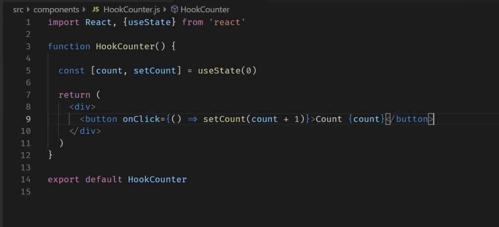

You're asking to **create a class component using `useState`**, but there's a small misunderstanding:

> ❗ `useState` is a **React Hook** and can **only be used inside functional components**, **not class components**.

If you want to create a **counter button example using `useState`**, it must be done in a **functional component**.

However, if you're looking for a **class-based version of a counter**, I can show that too — but without `useState`.

Let me clarify both versions for you:

---

## ✅ 1. Functional Component with `useState` (Recommended in Modern React)

```jsx
import React, { useState } from 'react';

function Counter() {
  const [count, setCount] = useState(0);

  return (
    <div>
      <p>You clicked {count} times</p>
      <button onClick={() => setCount(count + 1)}>
        Click me
      </button>
    </div>
  );
}

export default Counter;
```

### 🔍 Explanation:
- `useState(0)` initializes the state variable `count` to `0`.
- `setCount` is the function used to update the state.
- Every time the button is clicked, `count` increases by 1 and the component re-renders.

---

## 🧱 2. Class Component Equivalent (No `useState`, just regular class state)

```jsx
import React, { Component } from 'react';

class Counter extends Component {
  constructor(props) {
    super(props);
    this.state = {
      count: 0,
    };
  }

  render() {
    return (
      <div>
        <p>You clicked {this.state.count} times</p>
        <button onClick={() => this.setState({ count: this.state.count + 1 })}>
          Click me
        </button>
      </div>
    );
  }
}

export default Counter;
```

### 🔍 Explanation:
- In class components, state is managed via `this.state`.
- To update state, we use `this.setState()`.

---

## Summary

| Feature | Functional Component (`useState`) | Class Component |
|--------|------------------------------------|----------------|
| State declaration | `const [state, setState] = useState(initialValue)` | `this.state = { value }` |
| State update | `setState(newValue)` | `this.setState({ value: newValue })` |
| Supported in | React 16.8+ | All versions |

---

Let me know which one you'd like to explore further — or if you'd like to see how custom hooks can replace logic traditionally handled in class components!

