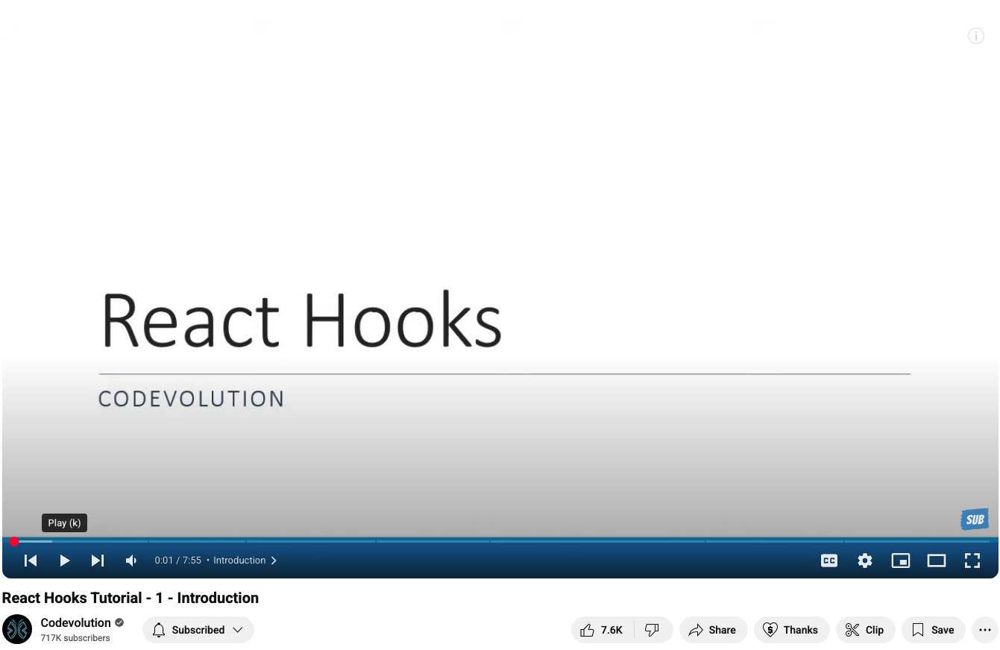
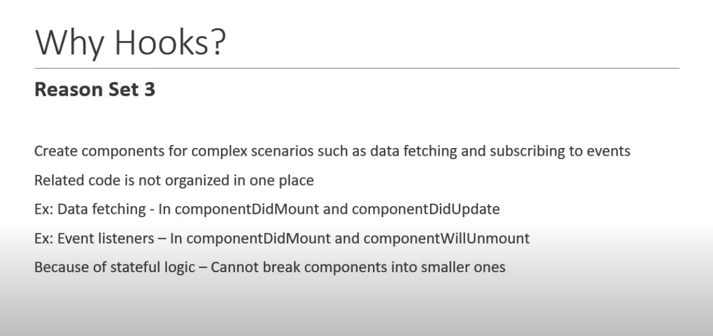
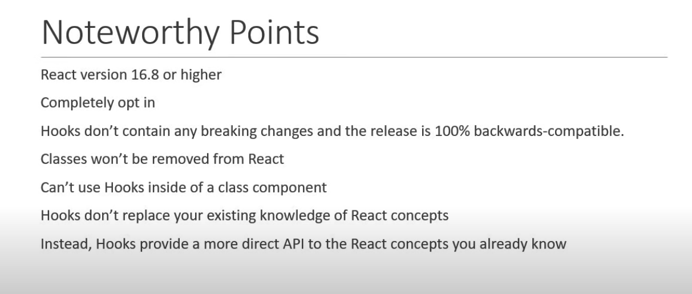

https://www.youtube.com/watch?v=cF2lQ_gZeA8&list=PLC3y8-rFHvwisvxhZ135pogtX7_Oe3Q3A

React Hooks Tutorial - 1 
Introduction

React Hooks

Prerequisites
 - Basic of React
 - Functional and Class components, props, state, lifecycle

What are React Hooks?

Hooks are a new features addition in React Version 16.8 which allow you to use React Features with out having to write a class

Example: State of a component

* Hooks don't work inside classes

What Hooks?
 Reason Set 1: 
  Understand how this keyword works in JavaScripts 
  Remember to bind event handlers in class components
  Classes don't minity very well and make hot reloading very unreliable

 Reason Set 2: 
 There is no particlular way to reuse stateful component logic
 HOC and render props pattern do address this problem
 Make the code harder to follow
 There is a need a to share stateful logic in a better way

  Reason Set 3: 

  Create components for complex scenarios such as data fetching and subscribing to events
  Related code is not organized in one place and scattered in multiple places

  

