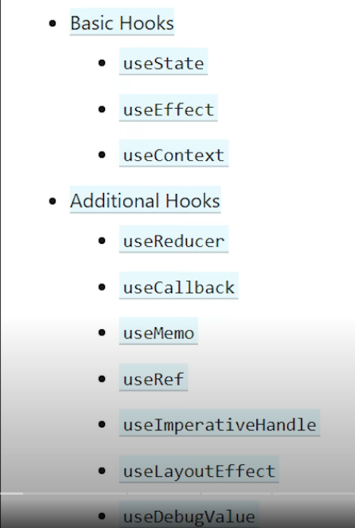

https://www.youtube.com/watch?v=TNhaISOUy6Q



Basic Hooks
- useState
- useEffect
- useContext

Additional Hooks
- useReducer
- useCallback
- useMemo
- useRef
- useImperativeHandle
- useLayoutEffect
- useDebugValue

The image you provided lists various React hooks, which are functions that let you "hook into" React features without writing a class. Hooks are a fundamental part of modern React development and allow developers to use state and other React features in functional components. Below is a breakdown of the hooks listed in the image:

### **Basic Hooks**
These are the most commonly used hooks in React.

1. **`useState`**
   - Used to add state to functional components.
   - Syntax: `const [state, setState] = useState(initialState);`
   - Example:
     ```jsx
     import React, { useState } from 'react';

     function Counter() {
       const [count, setCount] = useState(0);

       return (
         <div>
           <p>You clicked {count} times</p>
           <button onClick={() => setCount(count + 1)}>Click me</button>
         </div>
       );
     }
     ```

2. **`useEffect`**
   - Allows you to perform side effects in functional components (e.g., data fetching, DOM manipulation).
   - Syntax: `useEffect(effectCallback, dependencies);`
   - Example:
     ```jsx
     import React, { useEffect } from 'react';

     function Example() {
       useEffect(() => {
         document.title = `You clicked ${count} times`;
       });

       return <h1>Hello, world!</h1>;
     }
     ```

3. **`useContext`**
   - Used to consume values from a context provider.
   - Syntax: `const value = useContext(Context);`
   - Example:
     ```jsx
     import React, { createContext, useContext } from 'react';

     const ThemeContext = createContext();

     function App() {
       return (
         <ThemeContext.Provider value="dark">
           <Toolbar />
         </ThemeContext.Provider>
       );
     }

     function Toolbar() {
       const theme = useContext(ThemeContext);
       return <ThemedButton theme={theme} />;
     }
     ```

### **Additional Hooks**
These hooks provide more advanced functionality and are often used in specific scenarios.

4. **`useReducer`**
   - An alternative to `useState` for managing complex state logic.
   - Syntax: `const [state, dispatch] = useReducer(reducer, initialState);`
   - Example:
     ```jsx
     import React, { useReducer } from 'react';

     function reducer(state, action) {
       switch (action.type) {
         case 'increment':
           return { count: state.count + 1 };
         case 'decrement':
           return { count: state.count - 1 };
         default:
           throw new Error();
       }
     }

     function Counter() {
       const [state, dispatch] = useReducer(reducer, { count: 0 });

       return (
         <>
           Count: {state.count}
           <button onClick={() => dispatch({ type: 'increment' })}>+</button>
           <button onClick={() => dispatch({ type: 'decrement' })}>-</button>
         </>
       );
     }
     ```

5. **`useCallback`**
   - Returns a memoized version of the callback function, which only re-renders when its dependencies change.
   - Syntax: `const memoizedCallback = useCallback(callback, dependencies);`
   - Example:
     ```jsx
     import React, { useCallback } from 'react';

     function ParentComponent() {
       const handleClick = useCallback(() => {
         console.log('Button clicked');
       }, []);

       return <ChildComponent onClick={handleClick} />;
     }

     function ChildComponent({ onClick }) {
       return <button onClick={onClick}>Click me</button>;
     }
     ```

6. **`useMemo`**
   - Memoizes expensive computations by caching the result based on dependencies.
   - Syntax: `const memoizedValue = useMemo(() => computeExpensiveValue(a, b), [a, b]);`
   - Example:
     ```jsx
     import React, { useMemo } from 'react';

     function ExpensiveComponent({ data }) {
       const processedData = useMemo(() => processData(data), [data]);

       return <div>{processedData}</div>;
     }
     ```

7. **`useRef`**
   - Creates a mutable reference that persists across renders.
   - Syntax: `const refObject = useRef(initialValue);`
   - Example:
     ```jsx
     import React, { useRef } from 'react';

     function TextInputWithFocusButton() {
       const inputRef = useRef(null);

       function handleClick() {
         inputRef.current.focus();
       }

       return (
         <>
           <input ref={inputRef} type="text" />
           <button onClick={handleClick}>Focus the input</button>
         </>
       );
     }
     ```

8. **`useImperativeHandle`**
   - Customizes the instance value exposed to parent components when using `ref`.
   - Syntax: `useImperativeHandle(ref, createHandle, [deps]);`
   - Example:
     ```jsx
     import React, { useImperativeHandle, useRef } from 'react';

     const MyComponent = React.forwardRef((props, ref) => {
       const handle = {
         customMethod() {
           console.log('This is a custom method');
         },
       };

       useImperativeHandle(ref, () => handle);

       return <div>My Component</div>;
     });
     ```

9. **`useLayoutEffect`**
   - Similar to `useEffect`, but it runs synchronously after all DOM mutations.
   - Syntax: `useLayoutEffect(effectCallback, dependencies);`
   - Example:
     ```jsx
     import React, { useLayoutEffect } from 'react';

     function LayoutEffectExample() {
       useLayoutEffect(() => {
         console.log('Layout effect ran');
       });

       return <div>Layout Effect Example</div>;
     }
     ```

10. **`useDebugValue`**
    - Sets a label for hooks in React DevTools.
    - Syntax: `useDebugValue(value, formatFunction);`
    - Example:
      ```jsx
      import React, { useState, useDebugValue } from 'react';

      function DebugHook() {
        const [count, setCount] = useState(0);
        useDebugValue(`Count: ${count}`);

        return (
          <div>
            <p>{count}</p>
            <button onClick={() => setCount(count + 1)}>Increment</button>
          </div>
        );
      }
      ```

### **Summary**
- **Basic Hooks**: `useState`, `useEffect`, `useContext` – Core hooks for state management, side effects, and context.
- **Additional Hooks**: `useReducer`, `useCallback`, `useMemo`, `useRef`, `useImperativeHandle`, `useLayoutEffect`, `useDebugValue` – Advanced hooks for optimizing performance, managing references, and customizing behavior.

These hooks collectively empower developers to build complex UIs with functional components while maintaining clean and maintainable code.