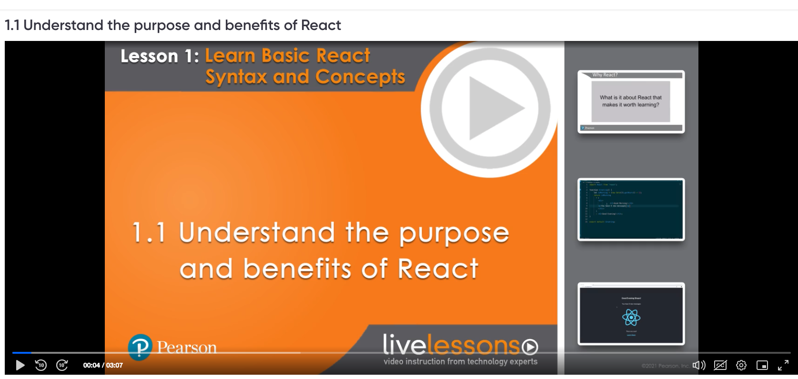
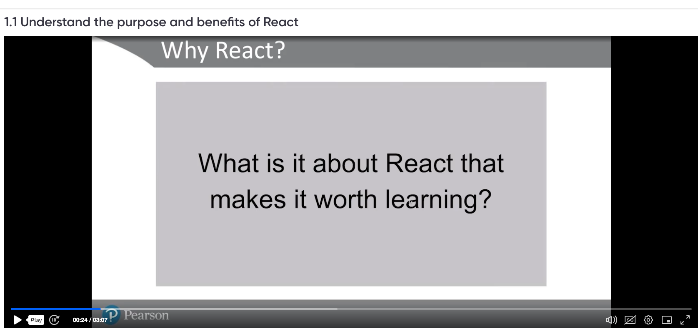
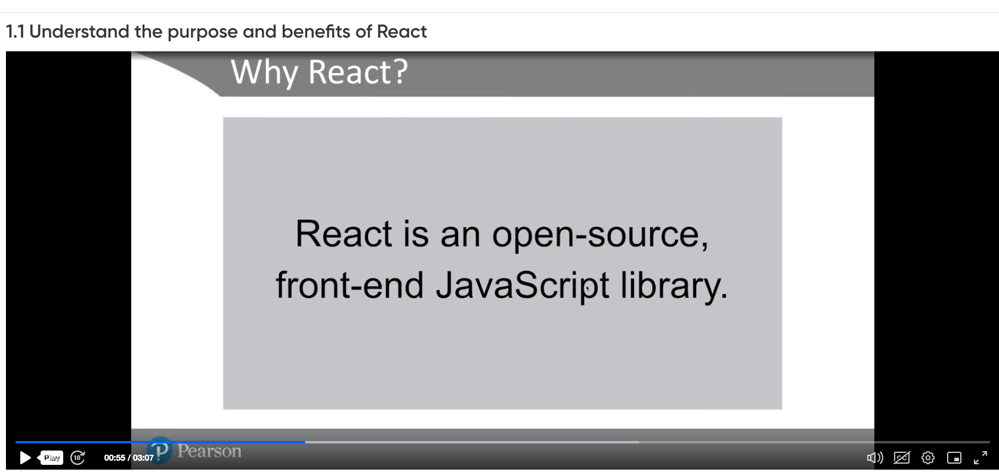
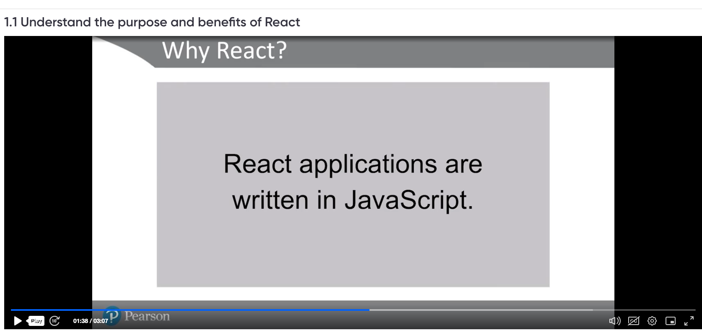

Learn React for Modern Web Applications. by Shaun Wassell
https://learning.oreilly.com/course/learn-react-for/9780136784395/

Git references - source code
 https://github.com/shaunwa/learn-react-livelessons.

