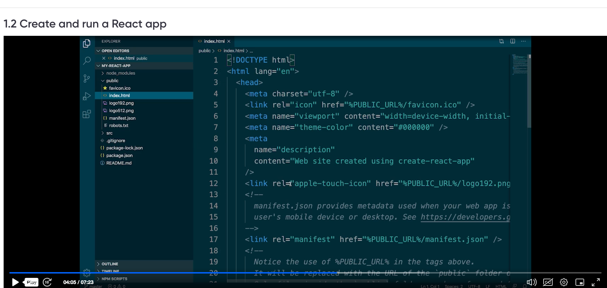
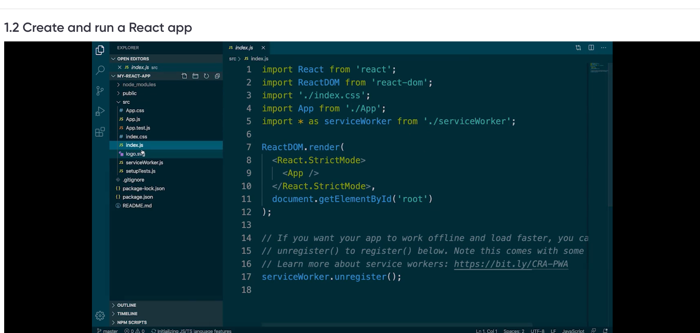
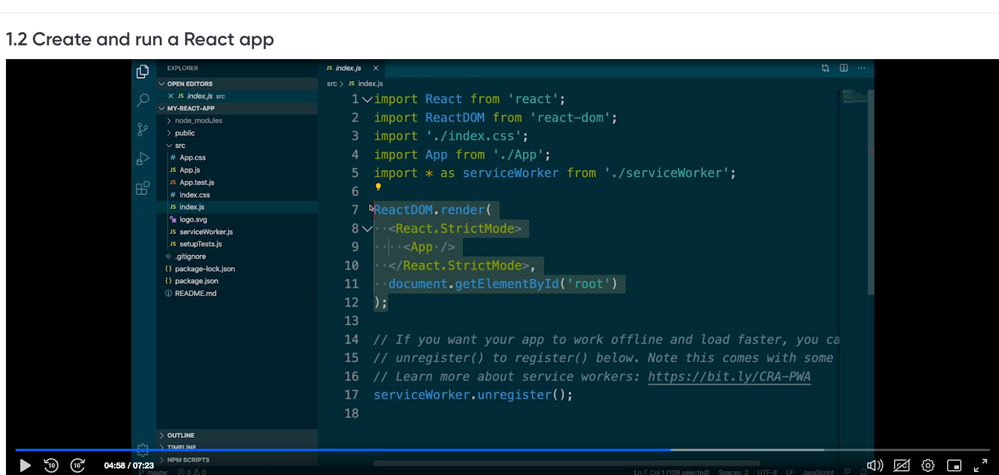
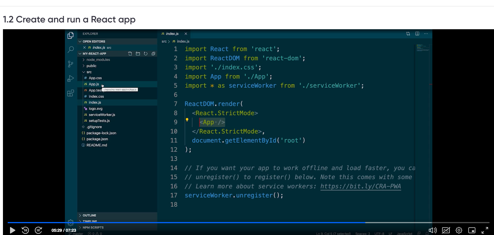
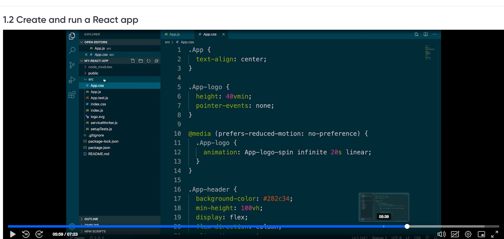
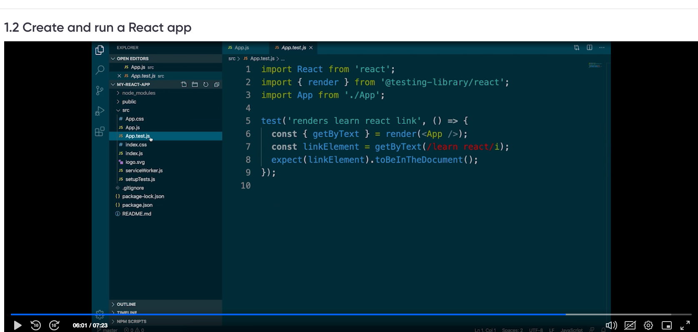
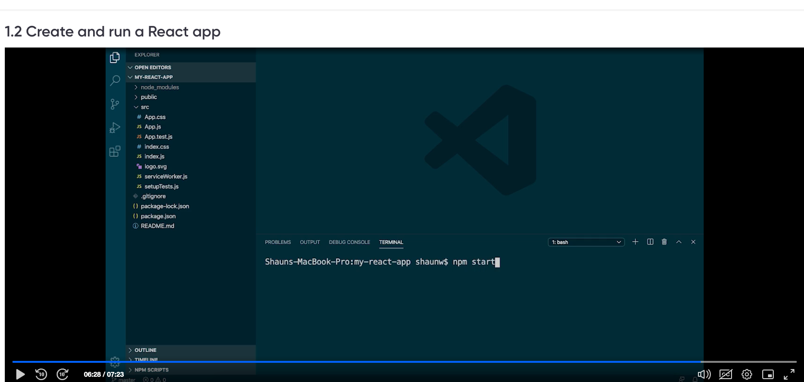
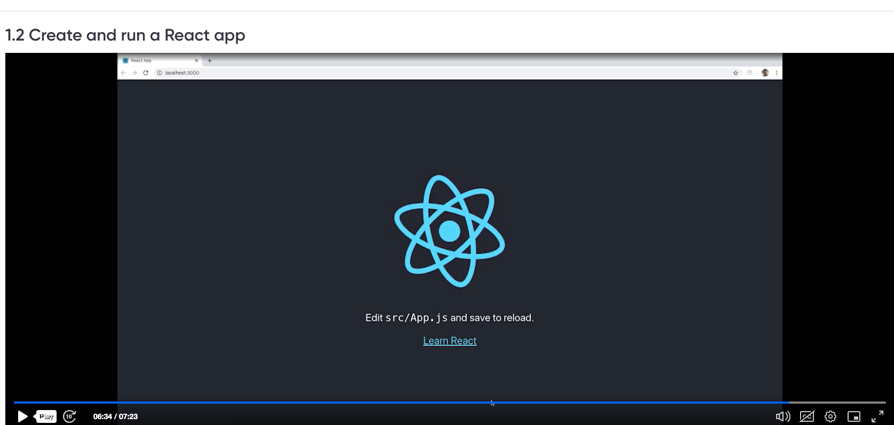

command to create react app 

npx create-react-app my-react-app --use-npm

![JSX(image-11.png)

execute the app from cloud spaces

https://super-duper-fortnight-qx4ww9xrx4gcg6j-3000.app.github.dev/