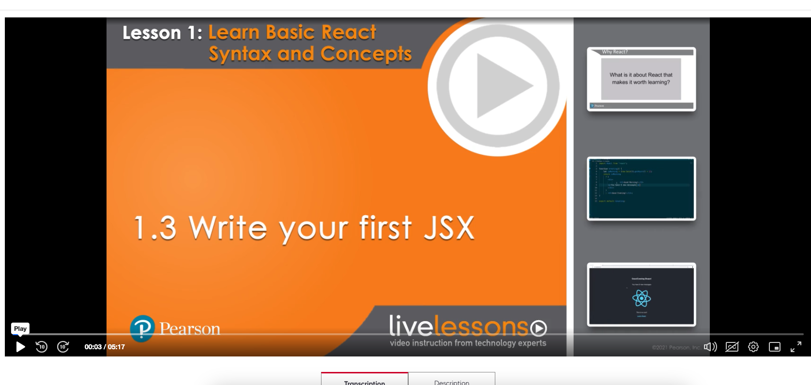
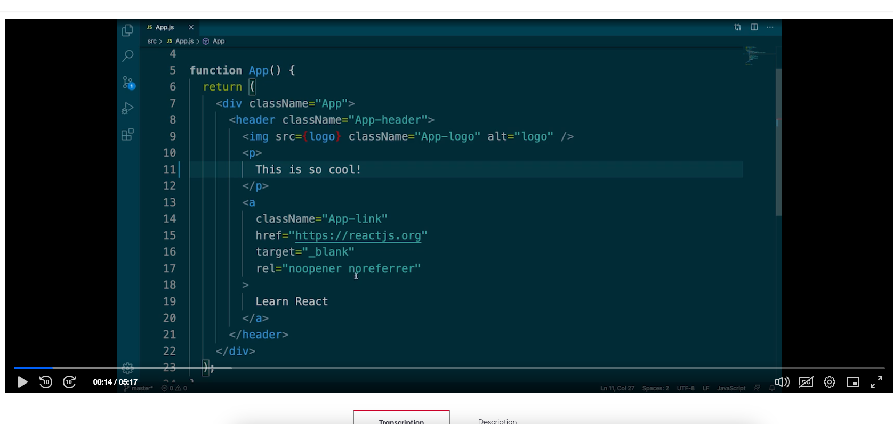
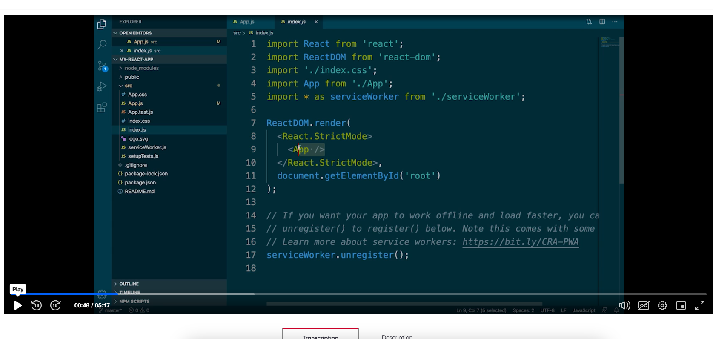
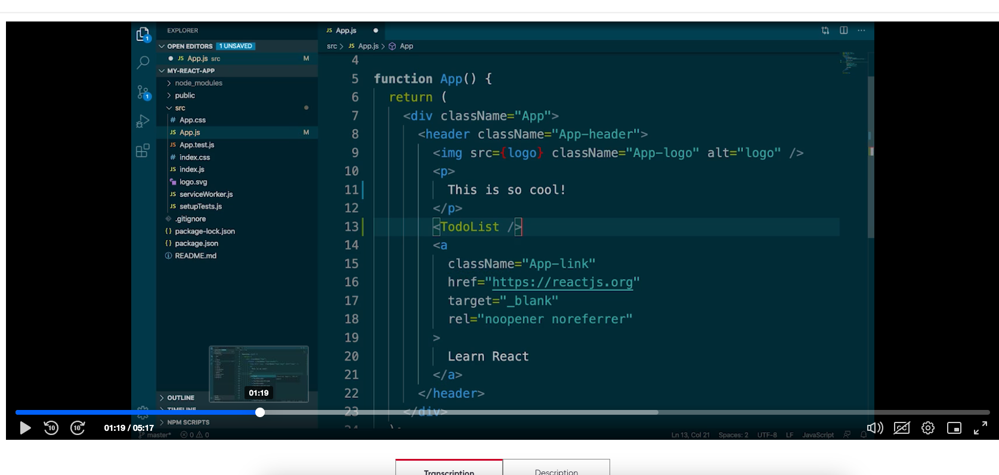

As of now that component does'nt exists

To display differnt greeting on the page based on the time

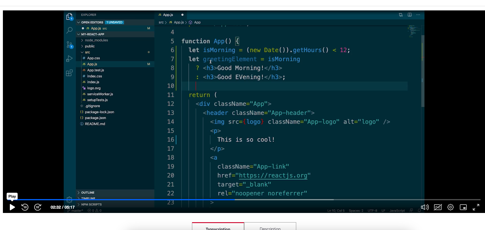
```
let isMorning = (new Date()).getHours() < 12;
let greetingElement = isMorning?
                        <h3> Good Morning! </h3>
                        : <h3> Good Evening! </h3>
```


just to create app in Lession-1.3 folder

  npx create-react-app my-react-app --use-npm

  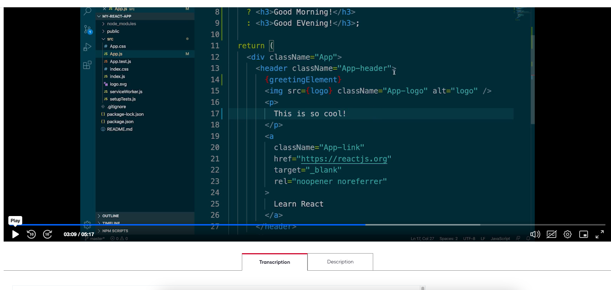
   {greetingElement}

   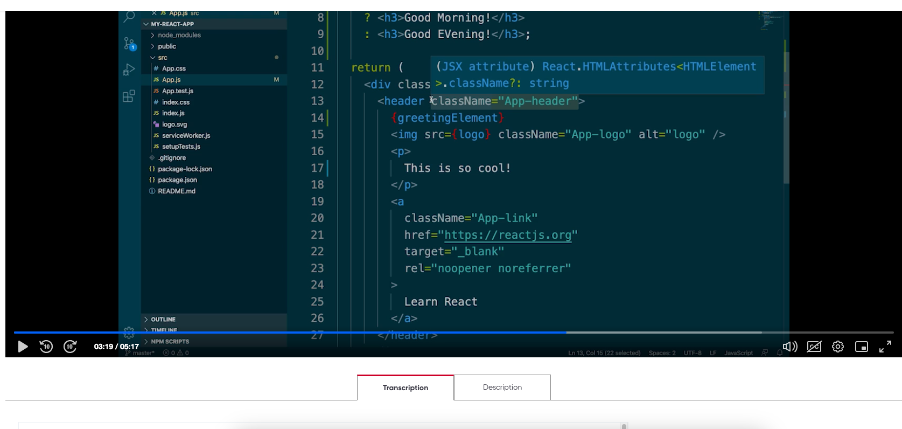

   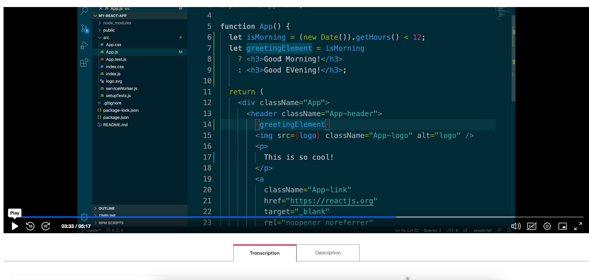

   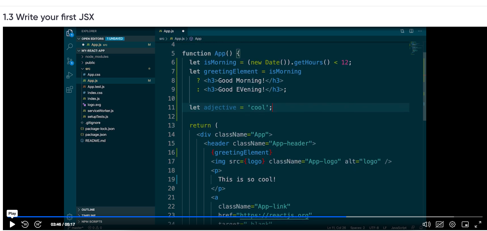

   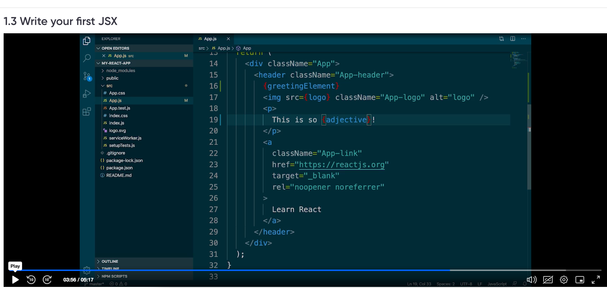

   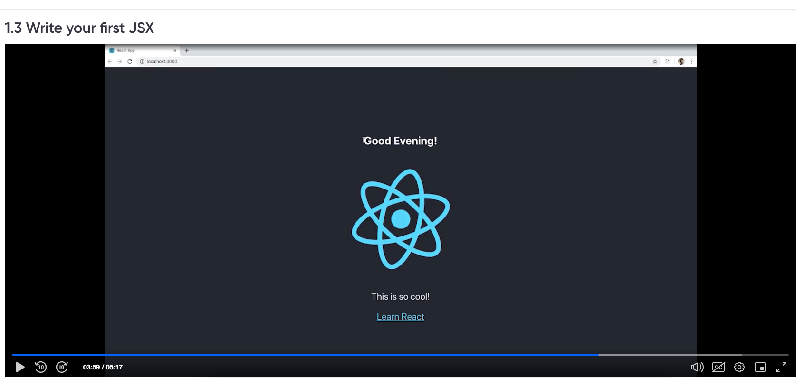

   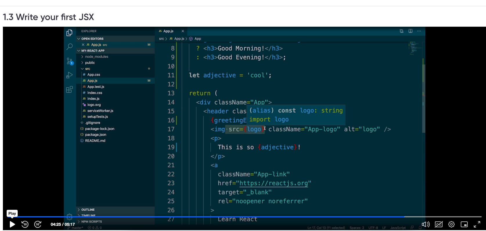

   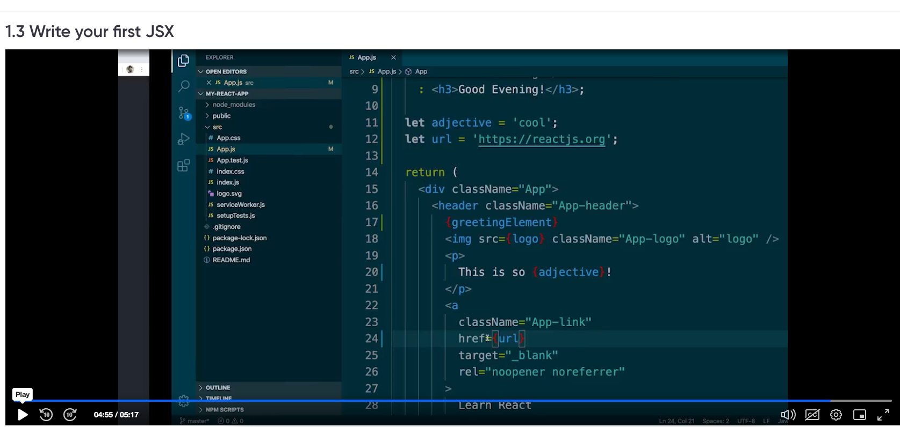