1.4 Create React Components
https://learning.oreilly.com/videos/react-zero-to/9780137611676/9780137611676-LRMW_01_01_04/

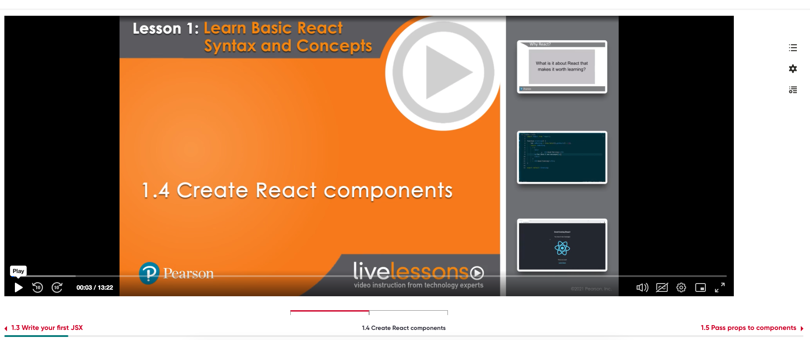
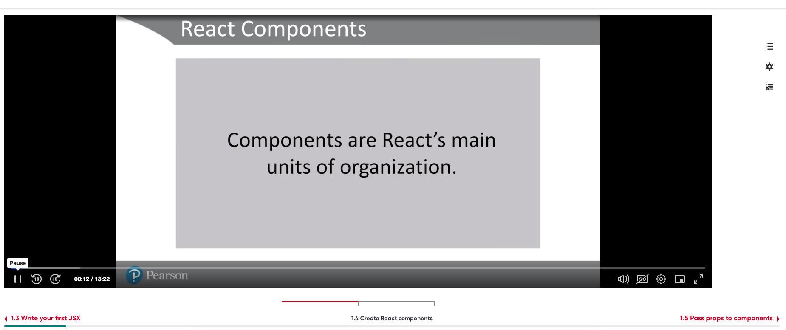
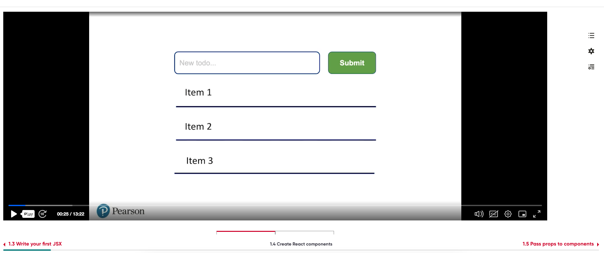
Todo List Showcasing 
* Text Box to enter todolist item 
* Submit button
* List of items

Components
* Component with Text Box and Submit Botton
* Component with Item1 (List)
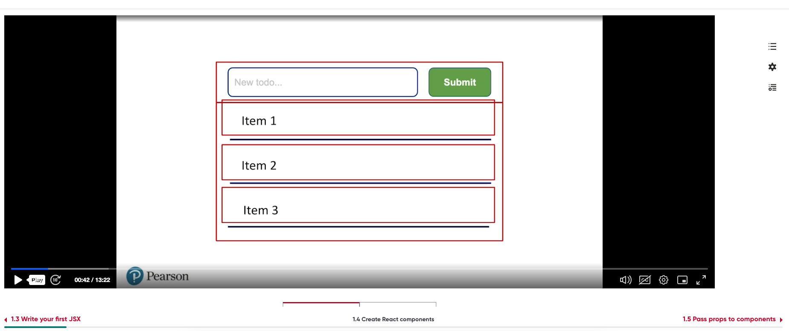

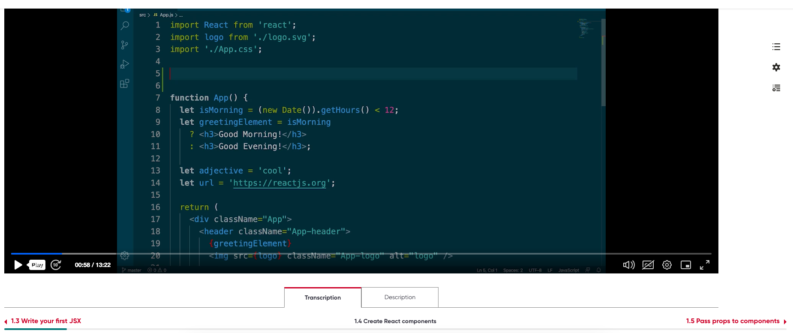


``` 
class App extends React.Component {

}
``` 
Modren way is use to use functional component sytaxt 

functions which retun JSX are functional compoments,
The example we saw is App component which retuns the Logo and
where we included Good morning!/Good Evening

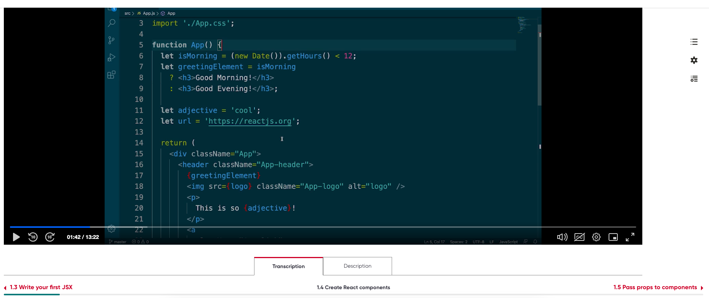
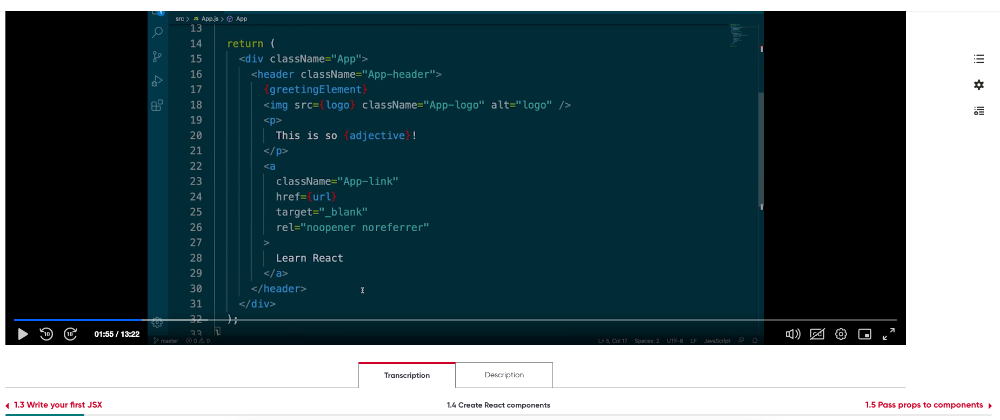
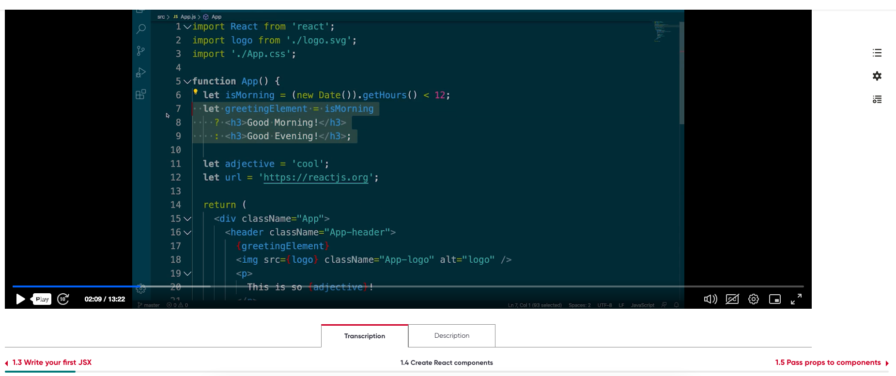

Convert Good Morning/Good Evening into a Greeting Component

then we import and display in App Component

npx create-react-app my-react-app --use-npm
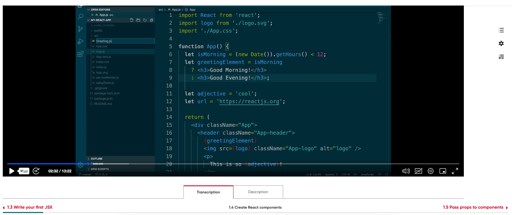


Creating New File Greeting.js

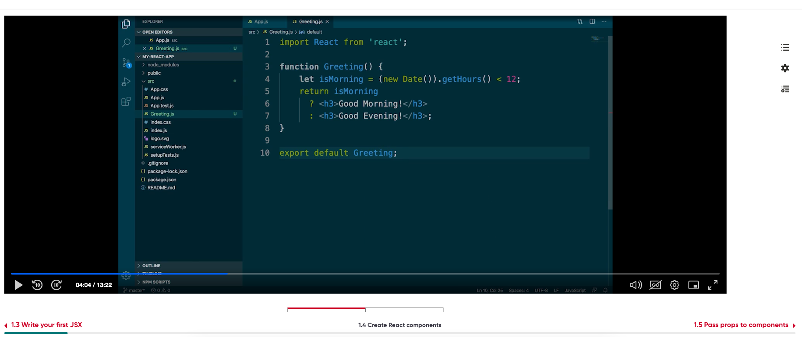

 * define a function Greeting
 * return the JSX String or the variable
 * import React from 'react';
 * export Greeting Component using ``` export default Greeting; ```

 In App.js

 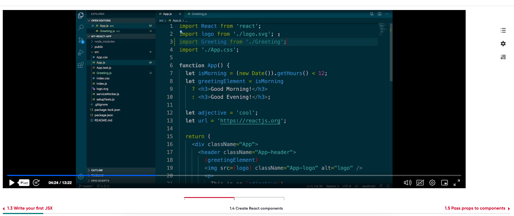

 import Greeting from './Greeting';

