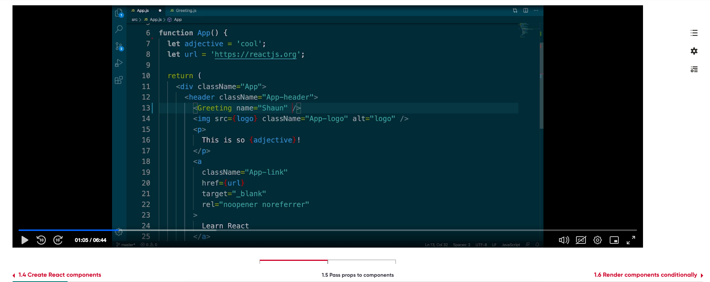
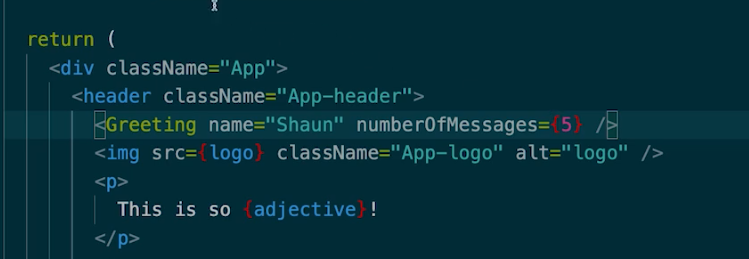
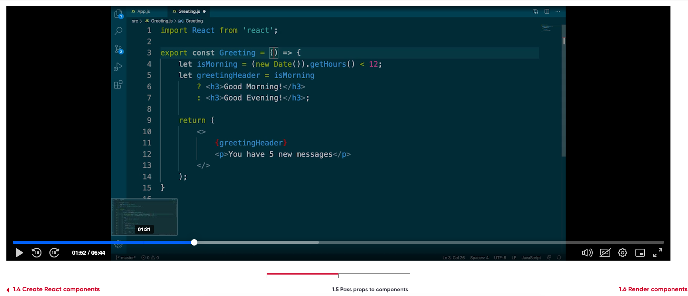
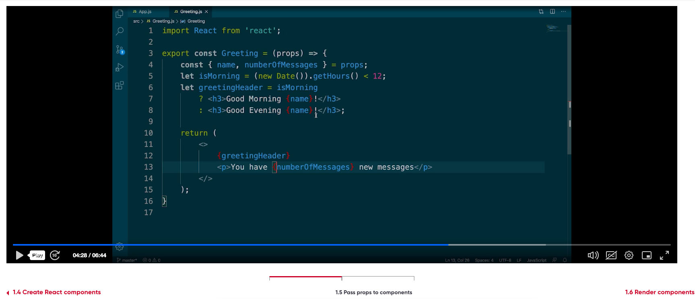
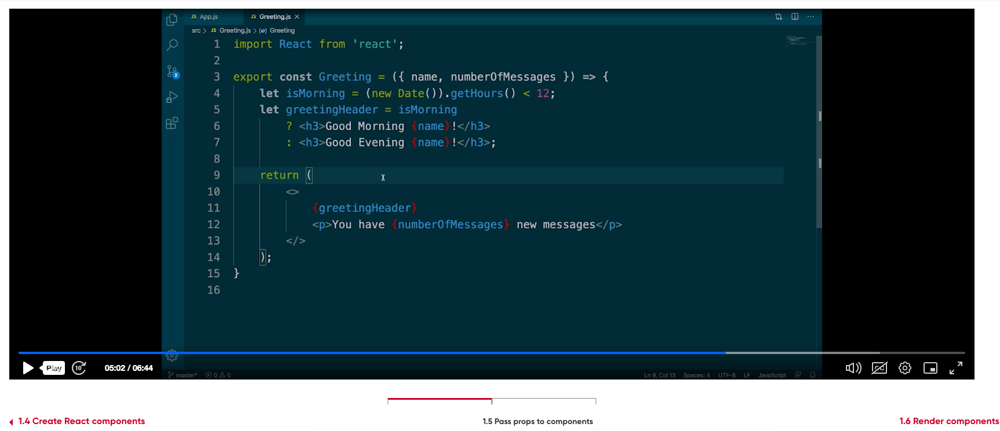
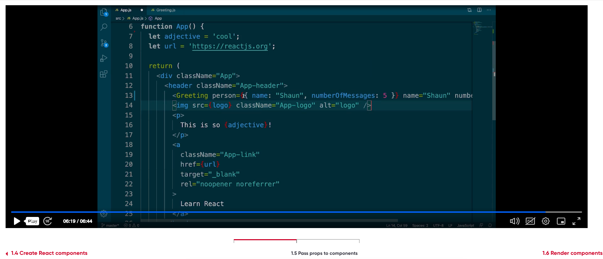

https://super-duper-fortnight-qx4ww9xrx4gcg6j-3000.app.github.dev/

1.5 Pass props to components





Command to generate react app
``` 
npx create-react-app my-react-app --use-npm

```



<Greeting name="Shaun" noOfMessages={5}>




