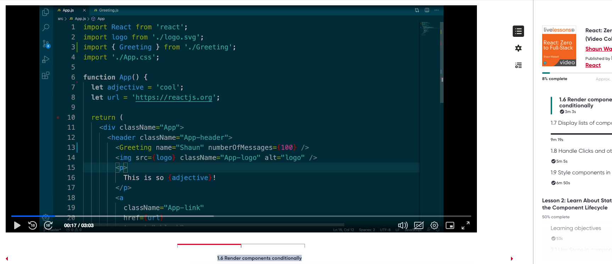
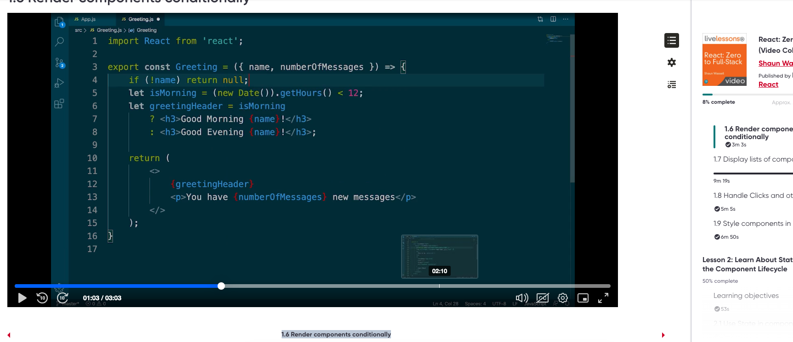
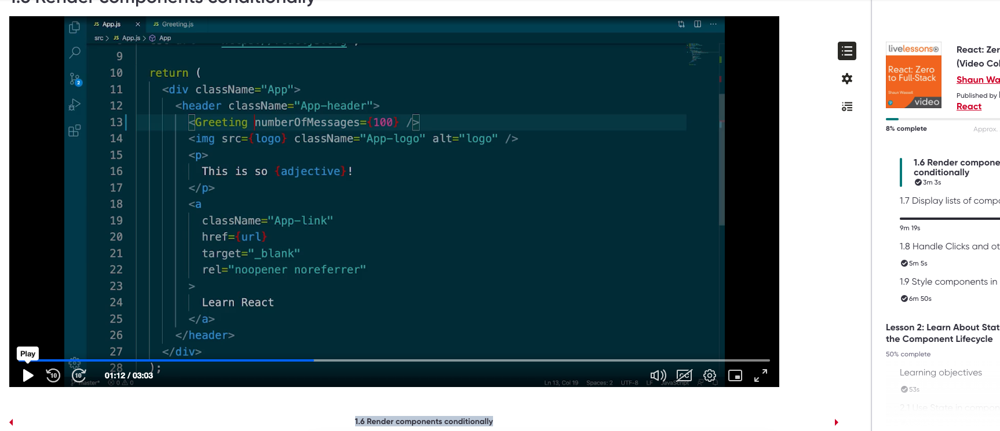
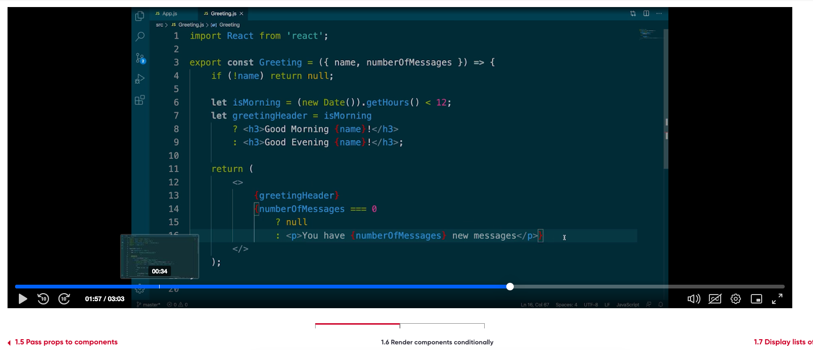
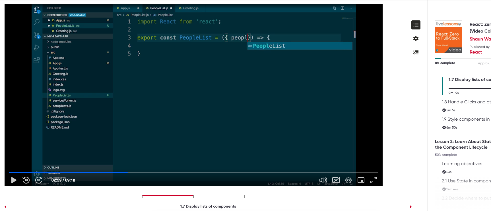

1.6 Render components conditionally
https://learning.oreilly.com/videos/react-zero-to/9780137611676/9780137611676-LRMW_01_01_06/

Command to generate react app
``` 
npx create-react-app my-react-app --use-npm

```




In this case we are  returning null and not displaying the component





